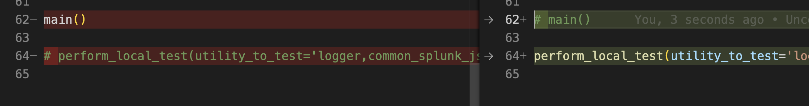

# Splunk-App-Common-Utilities-Action

## Utilities Available and Configuration
* Please go through `action.yml` file to see all configuration option and details.

* Example for GitHub Workflow action setup.
    * Setup GitHub repo secret. (Required to allow action to create PR to your repo with changes.)
        * `GH_TOKEN` - GitHub Token
        * [How to generate GitHub Token](https://docs.github.com/en/enterprise-cloud@latest/authentication/keeping-your-account-and-data-secure/creating-a-personal-access-token)
        * [How to set repository secret](https://docs.github.com/en/actions/security-guides/encrypted-secrets)
    
    * Workflow action code sample.

        ```
        name: "Add Splunk App Related Utilities to my App"

        on:
        push:
            branches:
            - 'master'

        jobs:
        pre-release:
            name: "Pre Release"
            runs-on: "ubuntu-latest"

            steps:
            - uses: CrossRealms/Splunk-App-Common-Utility-Action@v1
                with:
                GH_TOKEN: ${{ secrets.GH_TOKEN }}
                app_dir: "my_app"
                utilities_to_add: "logger,common_splunk_js_utilities"
                log_files_prefix: "my_app_log_"
                logger_sourcetype: "my_app:logs"
        ```


## Developer Notes

* Create a new tag and push the tag from git:
  ```
  git tag -a -m "v1" v1
  git push --follow-tags
  ```

* Update the tag from one commit to other:
  ```
  git tag -f -a -m "v1" v1
  git push -f --tags
  git push -f --follow-tags
  ```

* To delete tag
  ```
  git tag -d v1
  git push --delete origin v1
  ```


* Test the action script locally:
    * Made below change in `main.py` file.
        
